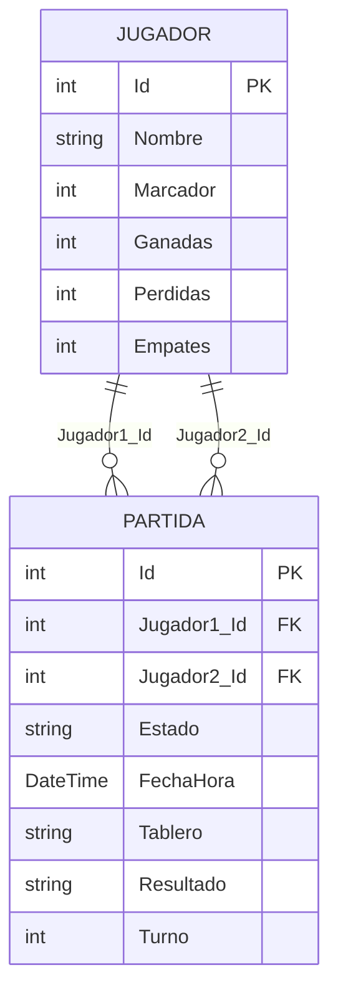

### Diagrama de la Base de Datos

#### Tablas

**Jugador**
| Campo      | Tipo    | Descripción                |
|------------|---------|---------------------------|
| Id         | int     | Clave primaria            |
| Nombre     | string  | Nombre del jugador        |
| Marcador   | int     | Puntos totales            |
| Ganadas    | int     | Partidas ganadas          |
| Perdidas   | int     | Partidas perdidas         |
| Empates    | int     | Partidas empatadas        |

**Partida**
| Campo        | Tipo      | Descripción                                 |
|--------------|-----------|---------------------------------------------|
| Id           | int       | Clave primaria                              |
| Jugador1_Id  | int       | FK a Jugador (Jugador1)                     |
| Jugador2_Id  | int       | FK a Jugador (Jugador2)                     |
| Estado       | string    | Estado de la partida                        |
| FechaHora    | DateTime  | Fecha y hora de la partida                  |
| Tablero      | string    | Representación del tablero (JSON/cadena)    |
| Resultado    | string    | Resultado de la partida                     |
| Turno        | int       | Turno actual                                |

#### Relaciones

- **Partida.Jugador1_Id** → **Jugador.Id**
- **Partida.Jugador2_Id** → **Jugador.Id**

> Una partida tiene dos jugadores, y cada jugador puede estar en muchas partidas (como Jugador1 o Jugador2).

#### Diagrama visual (Mermaid)

#### Imagen de la API

# Endpoints de la API de Jugador

| Método | Ruta                | Descripción                                                                 |
|--------|---------------------|----------------------------------------------------------------------------|
| GET    | /api/jugador        | Obtiene la lista de todos los jugadores.                                    |
| GET    | /api/jugador/{id}   | Obtiene la información de un jugador específico por su id.                  |
| POST   | /api/jugador        | Crea un nuevo jugador con los datos enviados en el cuerpo de la petición.   |
| PUT    | /api/jugador/{id}   | Actualiza los datos de un jugador existente según su id.                    |
| DELETE | /api/jugador/{id}   | Elimina un jugador específico según su id.                                  |

## Detalle de cada endpoint

- **GET /api/jugador**
  - Devuelve la lista de todos los jugadores registrados en la base de datos.

- **GET /api/jugador/{id}**
  - Devuelve la información de un jugador específico según su id. Si no existe, retorna 404.

- **POST /api/jugador**
  - Crea un nuevo jugador con los datos enviados en el cuerpo de la petición. Devuelve el jugador creado y su id.

- **PUT /api/jugador/{id}**
  - Actualiza los datos de un jugador existente según su id. Si el id no coincide o el jugador no existe, retorna error.

- **DELETE /api/jugador/{id}**
  - Elimina un jugador específico según su id. Si no existe, retorna 404.

# Endpoints de la API de Partida

| Método | Ruta                | Descripción                                                                 |
|--------|---------------------|----------------------------------------------------------------------------|
| GET    | /api/partida        | Obtiene la lista de todas las partidas.                                     |
| GET    | /api/partida/{id}   | Obtiene la información de una partida específica por su id.                 |
| POST   | /api/partida        | Crea una nueva partida con los datos enviados en el cuerpo de la petición.  |
| PUT    | /api/partida/{id}   | Actualiza los datos de una partida existente según su id.                   |
| DELETE | /api/partida/{id}   | Elimina una partida específica según su id.                                 |

## Detalle de cada endpoint

- **GET /api/partida**
  - Devuelve la lista de todas las partidas, incluyendo los datos de ambos jugadores.

- **GET /api/partida/{id}**
  - Devuelve la información de una partida específica según su id, incluyendo los datos de ambos jugadores. Si no existe, retorna 404.

- **POST /api/partida**
  - Crea una nueva partida con los datos enviados en el cuerpo de la petición. Devuelve la partida creada y su id.

- **PUT /api/partida/{id}**
  - Actualiza los datos de una partida existente según su id. Si el id no coincide o la partida no existe, retorna error.

- **DELETE /api/partida/{id}**
  - Elimina una partida específica según su id. Si no existe, retorna 404.
